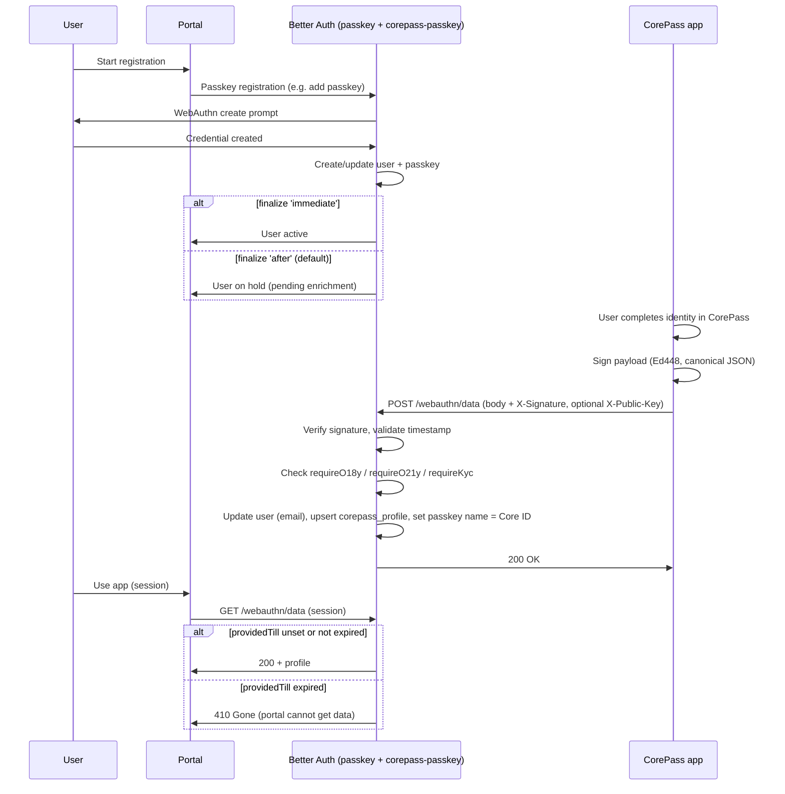

# CorePass Passkey Plugin for Better Auth

Better Auth plugin that adds **CorePass enrichment** on top of [@better-auth/passkey](https://better-auth.com/docs/plugins/passkey): signed identity and profile data (Core ID, email, age/kyc flags) sent from the CorePass app after passkey registration, with Ed448 signature verification and optional gating (requireO18y, requireO21y, requireKyc).

Use this plugin **after** the passkey plugin. It registers the `corepass_profile` schema and endpoints under your auth base path: **HEAD**, **GET**, **POST** `/webauthn/data`, .

## Flow overview

1. **Registration** – User starts passkey registration via Better Auth (passkey plugin). Email is optional or required depending on `requireEmail`.
2. **Finalize** – With `finalize: 'immediate'` the user is active right away. With `finalize: 'after'` (default) the user stays on hold until enrichment is received.
3. **Enrichment** – The CorePass app sends a signed payload to **POST** `{basePath}/webauthn/data` (e.g. `/api/auth/webauthn/data`). The plugin verifies the Ed448 signature over canonical JSON, then:
   - Finds the passkey by `credentialId`, loads the linked user
   - Enforces `requireO18y` / `requireO21y` / `requireKyc` from `userData` if set
   - Updates user email when provided
   - Upserts `corepass_profile` (coreId, o18y, o21y, kyc, kycDoc, `providedTill` from `dataExp` in minutes)
   - Sets the passkey’s display name to Core ID (uppercased)
4. **Data expiry** – If `userData.dataExp` (minutes) is set, the plugin stores `providedTill = now + dataExp * 60`. **GET** `/webauthn/data` returns the profile only while `providedTill >= now`; after that it returns **410 Gone** so the portal cannot read the data.

## Sequence diagram (registration + enrichment)



## Endpoints

All are under your Better Auth `basePath` (e.g. `/api/auth`).

| Method | Path | Description |
| --- | --- | --- |
| **HEAD** | `/webauthn/data` | **200** if enrichment is available (`finalize: 'after'`), **404** if not (`finalize: 'immediate'`). Use to detect whether the app should send enrichment. |
| **GET** | `/webauthn/data` | Requires session. Returns current user’s CorePass profile. **410 Gone** if `providedTill` has passed. |
| **POST** | `/webauthn/data` | CorePass enrichment: body + `X-Signature` (Ed448). Verifies signature, applies options, stores profile, updates user email and passkey name. |

## POST /webauthn/data: payload and signature

- **Body** (JSON): `coreId`, `credentialId`, `timestamp` (Unix **microseconds**), optional `userData`.
- **Headers**: `X-Signature` (required, Ed448), optional `X-Public-Key` (57-byte key when using short-form Core ID).

**Signature input** (what CorePass signs):

```text
"POST" + "\n" + signaturePath + "\n" + canonicalJsonBody
```

- `signaturePath` defaults to `/webauthn/data` (configurable via `signaturePath`).
- `canonicalJsonBody`: object keys sorted alphabetically, JSON stringified with no extra whitespace.

**userData** (all optional): `email`, `o18y`, `o21y`, `kyc`, `kycDoc`, `dataExp` (minutes → stored as `providedTill`). If `requireO18y` / `requireO21y` / `requireKyc` are set, the plugin rejects the request when the corresponding flag is not `true`.

## Installation and setup

1. Install after [@better-auth/passkey](https://better-auth.com/docs/plugins/passkey):

   ```bash
   npm install better-auth-corepass-passkey
   ```

2. Add the plugin **after** passkey in your Better Auth config:

   ```ts
   import { betterAuth } from 'better-auth';
   import { passkey } from '@better-auth/passkey';
   import { corepassPasskey } from 'better-auth-corepass-passkey';

   export const auth = betterAuth({
     // ...
     plugins: [
       passkey({ /* rpID, rpName, origin, ... */ }),
       corepassPasskey({
         requireEmail: true,
         finalize: 'immediate', // or 'after' (default): user on hold until enrichment
         signaturePath: '/webauthn/data',
         timestampWindowMs: 600_000,
         requireO18y: false,
         requireO21y: false,
         requireKyc: false,
       }),
       // ...
     ],
   });
   ```

3. Run migrations so the `corepass_profile` table exists (see [Schema](#schema)).

## Options

| Option | Type | Default | Description |
| --- | --- | --- | --- |
| `requireEmail` | `boolean` | — | Require email when registering; enrichment POST is rejected if userData.email is missing or empty. |
| `finalize` | `'immediate' \| 'after'` | `'after'` | When the user becomes active: `'immediate'` right after passkey registration; `'after'` when enrichment is received. |
| `signaturePath` | `string` | `'/webauthn/data'` | Path used when building the signature input string. |
| `timestampWindowMs` | `number` | `600_000` | Allowed clock skew for `timestamp` (microseconds). |
| `requireO18y` | `boolean` | — | Reject enrichment if `userData.o18y` is not true. |
| `requireO21y` | `boolean` | — | Reject enrichment if `userData.o21y` is not true. |
| `requireKyc` | `boolean` | — | Reject enrichment if `userData.kyc` is not true. |
| `allowedAaguids` | `string \| string[] \| false` | — | AAGUID allowlist for passkey registration. When set (string or non-empty array), only these authenticator AAGUIDs are accepted (enforced via passkey `create.before` DB hook). Use `false` or omit to allow any. |

## Schema

The plugin adds a `corepass_profile` model. Example migration (adjust for your DB):

```sql
CREATE TABLE "corepass_profile" (
  "userId" TEXT NOT NULL REFERENCES "user"("id") ON DELETE CASCADE PRIMARY KEY,
  "coreId" TEXT NOT NULL,
  "o18y" INTEGER NOT NULL,
  "o21y" INTEGER NOT NULL,
  "kyc" INTEGER NOT NULL,
  "kycDoc" TEXT,
  "providedTill" INTEGER
);
CREATE INDEX "corepass_profile_userId_idx" ON "corepass_profile"("userId");
```

Run your Better Auth schema generation / migrations so this table exists.

Better Auth and the passkey plugin manage WebAuthn challenge expiry via their own storage and TTLs. Registrations that never receive enrichment (e.g. user abandons after passkey create) remain as users with a passkey but no `corepass_profile`. You can expire or delete them manually (e.g. by age using `user.createdAt` and absence of `corepass_profile`) if needed.

## Client

Optional client plugin (no extra methods; enrichment is server-side):

```ts
import { createAuthClient } from 'better-auth/svelte';
import { passkeyClient } from '@better-auth/passkey/client';
import { corepassPasskeyClient } from 'better-auth-corepass-passkey/client';

export const authClient = createAuthClient({
  baseURL: 'https://your-app.com',
  plugins: [passkeyClient(), corepassPasskeyClient()],
});
```

## References

- [Better Auth – Passkey](https://better-auth.com/docs/plugins/passkey)
- [Better Auth – Your first plugin](https://better-auth.com/docs/guides/your-first-plugin)
- [CorePass](https://corepass.net/)

## License

Licensed under the MIT License - see the [LICENSE](LICENSE) file for details.
