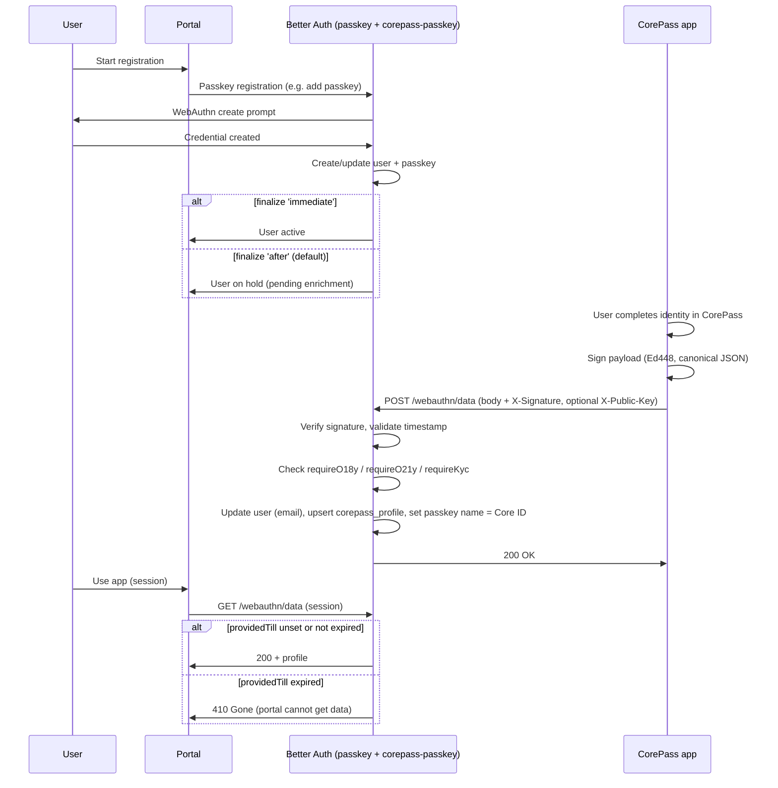

# CorePass Passkey Plugin for Better Auth

Better Auth plugin that adds **CorePass enrichment** on top of [@better-auth/passkey](https://better-auth.com/docs/plugins/passkey): signed identity and profile data (Core ID, email, age/kyc flags) sent from the CorePass app after passkey registration, with Ed448 signature verification and optional gating (requireO18y, requireO21y, requireKyc).

Use this plugin **after** the passkey plugin. It registers the `corepass_profile` schema and endpoints under your auth base path: **HEAD**, **GET**, **POST** `/webauthn/data`, .

## Flow overview

1. **Registration** – User starts passkey registration via Better Auth (passkey plugin). Email is optional or required depending on `requireEmail`.
2. **Finalize** – With `finalize: 'immediate'` the user is active right away. With `finalize: 'after'` (default) the user stays on hold until enrichment is received.
3. **Enrichment** – The CorePass app sends a signed payload to **POST** `{basePath}/webauthn/data` (e.g. `/api/auth/webauthn/data`). The plugin verifies the Ed448 signature over canonical JSON, then:
   - Finds the passkey by `credentialId`, loads the linked user
   - Enforces `requireO18y` / `requireO21y` / `requireKyc` from `userData` if set
   - Updates user email when provided
   - Upserts `corepass_profile` (coreId, o18y, o21y, kyc, kycDoc, `providedTill` from `dataExp` in minutes)
   - Sets the passkey’s display name to Core ID (uppercased)
4. **Data expiry** – If `userData.dataExp` (minutes) is set, the plugin stores `providedTill = now + dataExp * 60`. **GET** `/webauthn/data` returns the profile only while `providedTill >= now`; after that it returns **410 Gone** so the portal cannot read the data.

### Strict “passkey-only access” (anonymous bootstrap)

The plugin always enforces **passkey-only access**: users without at least one passkey are blocked from auth endpoints except public behaviour (safe methods and passkey registration routes). This is intended for **anonymous bootstrap** flows (e.g. Better Auth anonymous plugin): the app can sign in anonymously, but the account cannot be used until the user registers a passkey.

1. App signs in anonymously (or creates a session without a passkey).
2. Only public behaviour is allowed until the user has a passkey: safe methods (GET, HEAD, OPTIONS) and passkey registration routes (`/passkey/generate-register-options`, `/passkey/verify-registration`). No other routes (e.g. `/webauthn/data`, `/sign-out`) unless you add them via `allowRoutesBeforePasskey`.
3. User must add a passkey (scan/add to device); most complete this within a few minutes.
4. Once the user has at least one passkey, normal access to all auth endpoints is allowed.

**Timeout and cleanup:** Set `deleteAccountWithoutPasskeyAfterMs` (e.g. `300_000` for 5 minutes). If the user does not add a passkey within that time, the next request deletes the account and sessions and returns **403** with code `REGISTRATION_TIMEOUT`. The client can show "Registration timed out. Please start again." and let the user retry from step 1.

This is **not** “anonymous access” to the app; it is **passkey-only access** after an optional anonymous bootstrap. No email/password sign-up is introduced.

## Sequence diagram (registration + enrichment)



## Endpoints

All are under your Better Auth `basePath` (e.g. `/api/auth`).

| Method | Path | Description |
| --- | --- | --- |
| **HEAD** | `/webauthn/data` | **200** if enrichment is available (`finalize: 'after'`), **404** if not (`finalize: 'immediate'`). Use to detect whether the app should send enrichment. |
| **GET** | `/webauthn/data` | Requires session. Returns current user’s CorePass profile plus `hasPasskey` and `finalized`. **410 Gone** if `providedTill` has passed. |
| **POST** | `/webauthn/data` | CorePass enrichment: body + `X-Signature` (Ed448). Verifies signature, applies options, stores profile, updates user email and passkey name. |

## POST /webauthn/data: payload and signature

- **Body** (JSON): `coreId`, `credentialId`, `timestamp` (Unix **microseconds**), optional `userData`.
- **Headers**: `X-Signature` (required, Ed448), optional `X-Public-Key` (57-byte key when using short-form Core ID).

**Signature input** (what CorePass signs):

```text
"POST" + "\n" + signaturePath + "\n" + canonicalJsonBody
```

- `signaturePath` defaults to `/webauthn/data` (configurable via `signaturePath`).
- `canonicalJsonBody`: object keys sorted alphabetically, JSON stringified with no extra whitespace.

**userData** (all optional): `email`, `o18y`, `o21y`, `kyc`, `kycDoc`, `dataExp` (minutes → stored as `providedTill`). If `requireO18y` / `requireO21y` / `requireKyc` are set, the plugin rejects the request when the corresponding flag is not `true`. After signature verification, if data is invalid (e.g. missing or empty `coreId`) or any required check (o18y, o21y, kyc, email) fails, the plugin **deletes that user and their sessions** and then returns an error, so the account cannot be used without valid enrichment.

## Installation and setup

1. Install after [@better-auth/passkey](https://better-auth.com/docs/plugins/passkey):

   ```bash
   npm install better-auth-corepass-passkey
   ```

2. Add the plugin **after** passkey in your Better Auth config:

   ```ts
   import { betterAuth } from 'better-auth';
   import { passkey } from '@better-auth/passkey';
   import { corepassPasskey } from 'better-auth-corepass-passkey';

   export const auth = betterAuth({
     // ...
     plugins: [
       passkey({ /* rpID, rpName, origin, ... */ }),
       corepassPasskey({
         requireEmail: true,
         finalize: 'immediate', // or 'after' (default): user on hold until enrichment
         signaturePath: '/webauthn/data',
         timestampWindowMs: 600_000,
         requireO18y: false,
         requireO21y: false,
         requireKyc: false,
       }),
       // ...
     ],
   });
   ```

   **Example: anonymous bootstrap + passkey-only access**

   Use with the [anonymous](https://better-auth.com/docs/plugins/anonymous) plugin so users can get a session first, then must register a passkey to access the rest of the app:

   ```ts
   import { betterAuth } from 'better-auth';
   import { anonymous } from 'better-auth/plugins';
   import { passkey } from '@better-auth/passkey';
   import { corepassPasskey } from 'better-auth-corepass-passkey';

   export const auth = betterAuth({
     basePath: '/api/auth',
     plugins: [
       anonymous(),
       passkey({ rpID: 'your-domain.com', rpName: 'My App', origin: 'https://your-domain.com' }),
       corepassPasskey({
         deleteAccountWithoutPasskeyAfterMs: 300_000,
         finalize: 'after',
         // ... other options
       }),
     ],
   });
   ```

   Use **endpoint paths without basePath**: e.g. `/webauthn/data`, not `/api/auth/webauthn/data`. The auth router sees paths relative to itself, so the plugin matches `/webauthn/data`. You only need to set `allowPasskeyRegistrationRoutes` if you use custom passkey paths; the default already allows the standard passkey plugin routes so registration and login work without extra config.

3. Run migrations so the `corepass_profile` table exists (see [Schema](#schema)).

## Options

| Option | Type | Default | Description |
| --- | --- | --- | --- |
| `finalize` | `'immediate' \| 'after'` | `'after'` | When the user becomes active: `'immediate'` right after passkey registration; `'after'` when enrichment is received. |
| `signaturePath` | `string` | `'/webauthn/data'` | Path used when building the signature input string. |
| `timestampWindowMs` | `number` | `600_000` | Allowed clock skew for `timestamp` (microseconds). |
| `requireEmail` | `boolean` | — | Require email when registering; enrichment POST is rejected if userData.email is missing or empty. On failure (after signature verification), the user and sessions are deleted. |
| `requireO18y` | `boolean` | — | Reject enrichment if `userData.o18y` is not true. On failure (after signature verification), the user and sessions are deleted. |
| `requireO21y` | `boolean` | — | Reject enrichment if `userData.o21y` is not true. On failure (after signature verification), the user and sessions are deleted. |
| `requireKyc` | `boolean` | — | Reject enrichment if `userData.kyc` is not true. On failure (after signature verification), the user and sessions are deleted. |
| `allowedAaguids` | `string \| string[] \| false` | — | AAGUID allowlist for passkey registration. When set (string or non-empty array), only these authenticator AAGUIDs are accepted (enforced via passkey `create.before` DB hook). Use `false` or omit to allow any. |
| `allowRoutesBeforePasskey` | `string[]` | `[]` | No extra routes by default. Only public behaviour applies: safe methods (GET, HEAD, OPTIONS) and passkey registration routes. Add paths only if you need more. |
| `allowMethodsBeforePasskey` | `string[]` | `['GET', 'HEAD', 'OPTIONS']` | HTTP methods always allowed before first passkey (e.g. session fetch). |
| `allowPasskeyRegistrationRoutes` | `string[]` | `['/passkey/generate-register-options', '/passkey/verify-registration']` | Only needed if you use custom passkey paths. Default already allows registration; leave unset otherwise. |
| `deleteAccountWithoutPasskeyAfterMs` | `number` | `300_000` (5 min) | Accounts with no passkey after this many ms since creation are deleted on next request (sessions + user). Response **403** with code `REGISTRATION_TIMEOUT`. Set to 0 to disable. |

## Schema

The plugin adds a `corepass_profile` model. Example migration (adjust for your DB):

```sql
CREATE TABLE "corepass_profile" (
  "userId" TEXT NOT NULL REFERENCES "user"("id") ON DELETE CASCADE PRIMARY KEY,
  "coreId" TEXT NOT NULL,
  "o18y" INTEGER NOT NULL,
  "o21y" INTEGER NOT NULL,
  "kyc" INTEGER NOT NULL,
  "kycDoc" TEXT,
  "providedTill" INTEGER
);
CREATE INDEX "corepass_profile_userId_idx" ON "corepass_profile"("userId");
```

Run your Better Auth schema generation / migrations so this table exists.

Better Auth and the passkey plugin manage WebAuthn challenge expiry via their own storage and TTLs. Registrations that never receive enrichment (e.g. user abandons after passkey create) remain as users with a passkey but no `corepass_profile`. You can expire or delete them manually (e.g. by age using `user.createdAt` and absence of `corepass_profile`) if needed.

## Client

Optional client plugin (no extra methods; enrichment is server-side):

```ts
import { createAuthClient } from 'better-auth/svelte';
import { passkeyClient } from '@better-auth/passkey/client';
import { corepassPasskeyClient } from 'better-auth-corepass-passkey/client';

export const authClient = createAuthClient({
  baseURL: 'https://your-app.com',
  plugins: [passkeyClient(), corepassPasskeyClient()],
});
```

## Test plan (passkey-only access)

Minimal cases to verify the strict passkey-only flow:

1. **Anonymous session, zero passkeys → protected route denied**
   Sign in anonymously, call a protected auth endpoint (e.g. `/get-session` with POST or an endpoint that is not in the allowed list for the method). Expect **403** with body `code: 'PASSKEY_REQUIRED'`.

2. **Anonymous session, zero passkeys → passkey registration route allowed**
   Same session; call `/passkey/generate-register-options` or `/passkey/verify-registration` (and complete registration). Expect **200** (or normal flow).

3. **After passkey registration → protected route allowed**
   With the same user now having one passkey, call the previously blocked endpoint. Expect **200** (or normal response).

4. **After enrichment → GET /webauthn/data**
   With session and passkey, call GET `/webauthn/data`. Expect **200** and JSON including `hasPasskey: true`, `finalized: true`, and profile fields when not expired.

## References

- [Better Auth – Passkey](https://better-auth.com/docs/plugins/passkey)
- [Better Auth – Your first plugin](https://better-auth.com/docs/guides/your-first-plugin)
- [CorePass](https://corepass.net/)

## License

Licensed under the MIT License - see the [LICENSE](LICENSE) file for details.
